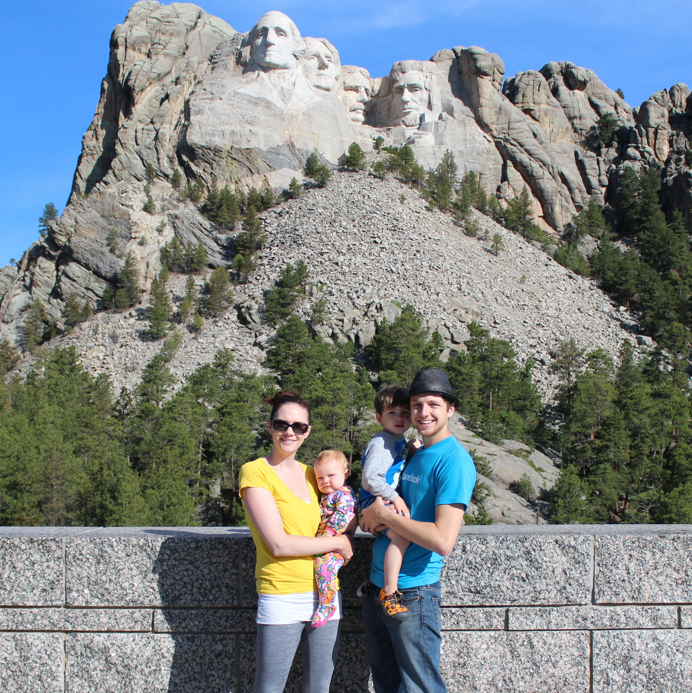

Well, everyone, we made it back from our big road trip. We visited Idaho, Montana, Wyoming, South Dakota, Minnesota, Wisconsin, Illinois, Iowa, Nebraska, Colorado, and Utah. That is a lot of states. We drove almost 5,000 miles! You may be wondering how these two kids did in the car? I am happy to answer that it went better than I expected. There were moments of tantrums and fighting between siblings and they both seem to push each other's buttons, but they were good most of the time.

Here are a few tips: Wells for his birthday received a little [VTech tablet](http://www.amazon.com/gp/product/B00AITW5J2/ref=as_li_tl?ie=UTF8&camp=1789&creative=390957&creativeASIN=B00AITW5J2&linkCode=as2&tag=ianobesblo-20) from one of his friends. We saved it only for the car and it was only for long distances. He absolutely loved it and it kept him busy for hours. Isla really likes to unpack bags, so I had a reusable bag filled with toys or container, which kept her entertained.

We like to book our hotels ahead of time so we don't have that stress while we are traveling. However, it sort of backfired on us since two of the days we overestimated the time we could cover due to construction or other deterrents. That made for some late nights and cranky kids. If you have access to a smart phone it would be worth it to book that same day so you can avoid some late nights. I would account for unplanned circumstances into your travel time. There was one day that I am pretty sure Wellington had to go to the bathroom every thirty minutes. That makes for a lot of stops along the way! Going with a newly potty trained child is going to be more difficult. Another thing we weren't planning for was all the construction. We know it is summer and a busy time, but how much construction was happening and for huge stretches of a time was unreal. I am quite sure it always happened when I was driving, too.

Well, readers we made it to and back from Wisconsin safe and sound with a little stop in Utah for some extended R&R at my in-laws place (we had the house to ourselves!). I think the kids enjoyed seeing all their family. I am glad we did it for the new experience, definitely some trials but the good memories are outweighing the bad. Where are you guys vacationing this summer? Anyone headed on a road trip?
