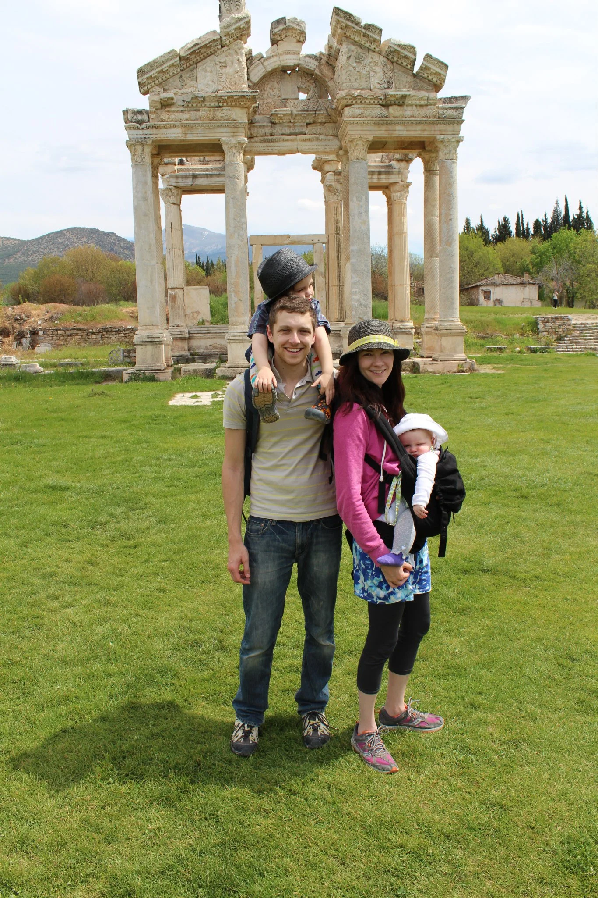

From [Pamukkale](http://youngmodernmama.com/2014/10/traveling-abroad-pamukkale/ "Traveling Abroad: Pamukkale") we took a day trip to the ancient ruins of Aphrodisias. It is a fairly long dolmush ride each way, about two hours, for which we paid ~80TL for two people. There are many big bus tours that go there but when we were there it was relatively empty, which made for the perfect trip. While it is a difficult journey to make it is incredibly worth the hassle. This city was composed mostly of marble from a large quarry nearby and it was a relatively wealthy city. Even though earthquakes hurt Aphrodisias a great deal, archaeologists have been able to reconstruct a lot of it and really well because of all the marble.

It was one of our favorite sites to visit due to the freedom with which you are left to explore the city. There are no guards except inside the museum. You are able to walk and explore where most other places would keep you at a distance. It was a great perspective to be able to put yourself where others once walked, to stand on the stage or walk where chariot races were held. Of course with that freedom comes the responsibility to treat the ruins with respect and not do anything that would spoil the experience for the next visitor. And, as far as we could tell, most people did just that, and despite a fair amount of visitors each year, Aphrodisias still feels pristine.

We had our stroller during the trip and it was useful because it is an expansive city and we did not want to miss anything. There is also a museum there with some of the more delicate pieces. We left that to the end because our time was limited and we wanted to make sure that we saw the city first.

We brought our own food and water on the trip. There were not a lot of options there and most museums are overpriced when it comes to those necessitates. Overall, even though traveling there is a huge hassle, it was well worth it to experience one of our favorite archaeological sites of all time. Our pictures from this part are some of our favorite and I hope you enjoy. Do ancient ruins interest you?
