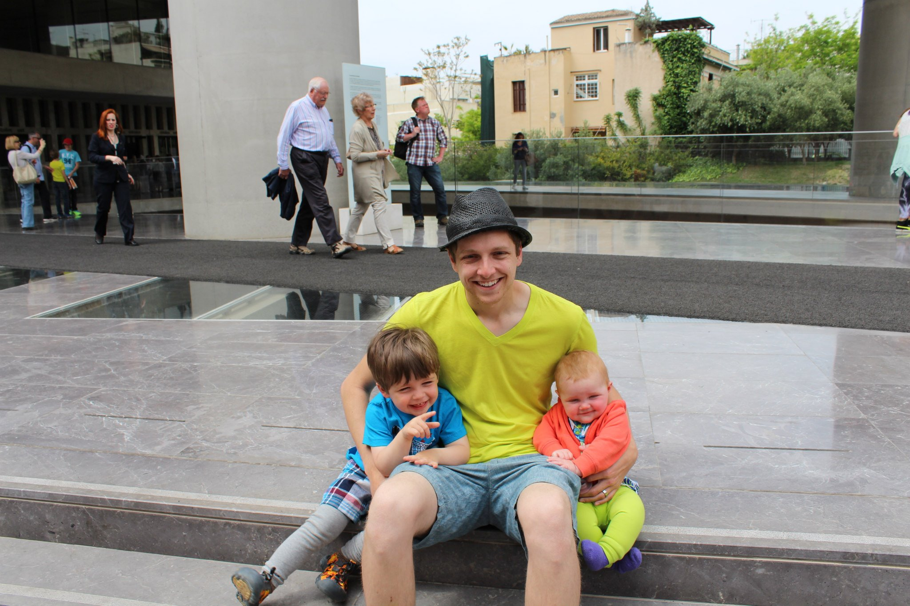

We have come to the last city on our European adventure of 2014. Hard to believe we went to all these cities. I am so happy to have blogged about it so the memories will always be there. I am a little sad writing this one as I fear it could be our last Europe trip for a long time. I mean travelling to Europe with 3 kids seems like a daunting prospect. I think I will just cross my fingers that my husband's job will one day be there and we will have the chance to call Europe home. For now I will give this last account.

In Athens we were able to stay in the city center through Airbnb. The location was perfect for us as it was close to food and public transportation. Our Airbnb hosts were great and with little fuss we were in the apartment. It had two bedrooms and I spent the nights with Isla while Ian stayed with Wells. It was great to be able to make the kids' food as there were grocery stores where we could easily get supplies. We ate a lot of olives and brought quite a few home with us!

Our host provided us with tickets to see the major attractions! It definitely helped us keep down on costs. We hit the Acropolis first as that is what we were most excited about. It was as beautiful as I imagined. However, it was under construction and in keeping with the rest of Greece had a lot of hired people standing around. I would highly recommend it but be sure to wear walking shoes as it is a bit of hike. Also, sun protection and lots of water are a must. My husband was lamenting that he forgot sunglasses and a hat! Wells had a good time posing for pictures and we met a really nice family while we were there who took a lot of our pictures for us! There are lots of different parts to see so I recommend carving out a half day to see everything.

Another must see is the new Acropolis museum. I have been to a lot of museums and this is one of the best planned and aesthetically pleasing museums I have ever been in. I could definitely have spent a lot longer there than we did if our kids weren't getting so hungry! There are also helpful guides in the museums to answer a lot of your questions.

There are lot of little sites to see throughout Athens. There were several temple ruins throughout the city, some of our favorites were the Stoa of Attalos (huge modern reconstruction financed by Rockefeller!), the Temple of Hephaestus. I would say three days is enough to see all Athens has to offer unless you plan to make a day trip outside of Athens. I can't imagine how hot it must get in summer, but for us April was the perfect temperature and weather.

I hope you have enjoyed our tour of Europe. In further travel posts I will be recounting the European trip I took with my son and husband in 2012. Also, our upcoming trips to California and Kauai. Our third Hawaiian trip with Wellington and Isla's first! I hope you will join us for those and feel free to ask any questions you may have. I am happy to share more of our in-depth research with you!
