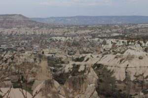
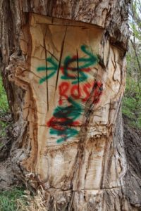
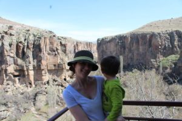
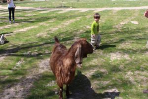
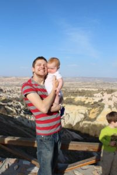
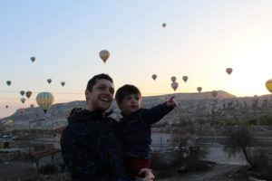

On the next leg of our journey in Turkey we headed east, leaving the European side of [Istanbul](http://youngmodernmama.com/2014/09/traveling-abroad-istanbul/ "Traveling Abroad: Istanbul") for Cappadocia a central region on the Asian side. This is the farthest east my husband and I have ever been. We flew there on Turkish Airlines, and if you ever have a chance to fly Turkish Airlines take it; we had the best experience of our lives! It is quality all around. On our one hour flight we received a meal that included a sandwich, salad, and chocolate mousse for dessert. Also, they had baby food for Isla and fabulous hospitality from the flight attendants. Compared to flying in America this quality was definitely a pleasant surprise.

After we landed we had to take a shuttle to the town of Goreme. It was very simple and relatively inexpensive, around 40TL ($18) for both of us (kids were free). The shuttle took us right to the hotel (Goreme Country House). Now this about lines up with all of our other hotel experiences in Turkey. The unfinished bathroom was not very clean. The bed was very uncomfortable, and the linens were sparse. It did come with breakfast that was cooked by the owner everyday, and was more of a western breakfast with eggs. It was on the edge of town, about a ten minute walk to the center.

Goreme is very walkable and everyone is very friendly in the town. We ate more Turkish pizza and kebabs. We got our meals mostly to-go so it was easier with the children. There was a grocery store here so it was easier to supplement meals and buy bottled water.

What to do in Cappadocia? If you like the outdoors and hiking there is a lot to do. We spent 4 nights there but found that 3 would have better for our family as hiking with children is much more difficult. On one hike we got very lost because of the trail markings. We started at a little town and it was supposed to be an easy and simple hike but we ended up gone for hours. If you do go hiking, purchase a trail map, which will help immensely. There were numbered trail markers, but the maps accompanying them were destroyed.

We did a group tour one of the days. Always negotiate the price directly with the tour guides. You will get the best prices that way, rather than going through your hotel. This whole day affair includes a lunch. It should be less than 100TL per person. Also, look for a tour guide that speaks English well. Ours did not speak English very well and it did hinder the quality of the tour. Be sure to take lots of water; buy a 5 liter bottle in the grocery store before you go or you will be paying a lot by the attractions. On this tour (known as the Green Tour) we visited the Selime Monastary, Derinkuyu Underground City, and Ihlara Valley. We were a little rushed, maybe because we were carrying a 2 year old and 6 month old. I would definitely recommend doing the tour because seeing these on your own would be very difficult, especially without renting a car. If you had a car or scooter, though, you'd be able to go at your leisure and probably see more in one day. Here is a great post going more in depth about the [Green tour](http://www.captivatingcappadocia.com/cappadocia-green-tour/).

On another day we visited the [Goreme Open Air Museum](http://www.goreme.com/goreme-open-air-museum.php). It was so amazing to see all the churches carved out of the stone with well preserved frescoes. Some of these churches are very elaborate. The museum itself is of course open air and can be hot with the sun beating down on you. Also, this is not a stroller friendly museum as you generally have to climb or descend to see the churches. Even so, I would highly recommend visiting. You don't really need a tour guide to see the museum, so if you can get a ride there and back (or walk if you are up for it) you can save some money.

Another popular thing to do there is hot air balloon rides. We did not do this while we were there as we generally didn't think our children would enjoy (Wells is sometimes scared of heights) it or being woken up at the extremely early hour to do them. We read that it is a must do but we feel that we were able to get quite a few good views and save ourselves the huge expense it would be (200 euros per person!), not to mention probably not enjoyable with children. Our last morning there we did manage to see a few balloons in the air. It was a beautiful sight from the ground.

In general I think Cappadocia is a must see especially if you enjoy hiking. I think 3 nights would have been more than enough. Do you want to visit?
