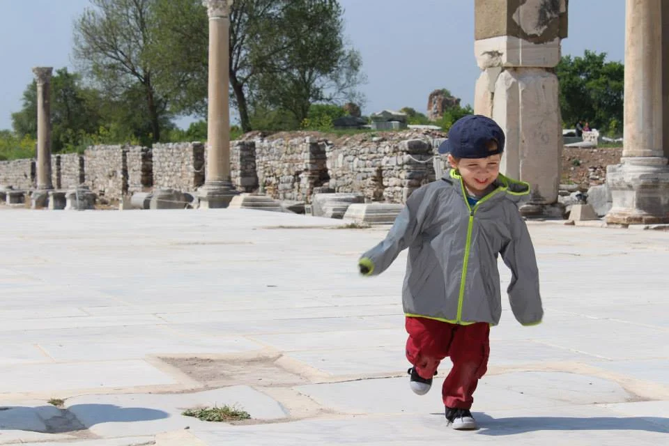

This is the part of our journey that I was looking forward to the most. The ruins of Ancient Ephesus have been a dream of mine to visit (yes, I am a total history nerd). To start this leg of our journey we flew from [Cappadocia](http://youngmodernmama.com/2014/09/traveling-abroad-cappadocia/ "Traveling Abroad: Cappadocia") to Izmir and then took an hour train ride to the town of Selcuk which lies a short distance away from the ruins.

The [Rebetika Hotel](http://www.tripadvisor.com/Hotel_Review-g293976-d1087120-Reviews-Rebetika_Hotel-Selcuk_Izmir_Province_Turkish_Aegean_Coast.html) was very roomy and spacious. The beds and bathroom quality were inline with previous Turkish hotels but the hospitality was excellent. The proprietors were friendly and well informed. Also, the breakfast was top notch. You sit on the grape-vined rooftop deck overlooking ruins while eating hot homemade cheese pastries. I still crave those amazing pastries. It was idyllic seeing the rolling hills, and the surrounding reminded me of Tuscany.

We had to walk from the train station to our hotel. It appeared to be a short walk on the map but it tricked us because of the big hill leading up to it! It was quite the trek but then a local who was helping his family open a bed and breakfast walked us all the way to our hotel, pulling our bags! It was an amazing experience and another show of how friendly people are in Turkey.

On our way to the hotel we stopped for Turkish pizza for only 5TL. It was the most amazing pizza and for an unbeatable price. It is made fresh when you order! We went there twice while we were in Selcuk and tried the meat and cheese pizzas;  the cheese was our favorite. We also ate kebabs, which were good but nothing compared to that pizza. There are also a few grocery stores to get fresh fruit and veggies, perfect additions to our meals.

Now on to visiting Ephesus. I have wanted to see this ancient site for years. We arrived to the site and it is very large. I strongly recommend an umbrella stroller for children. We did not take ours and we really needed it because the site is expansive and a lot of walking for a two year old. The site itself is beautifully restored with a lot of detail. The library of Celsus was breathtaking and we took a wonderful family picture. We seriously spent so much time just examining the detail of the library.

One of the best parts of visiting the site at Ephesus is the ability to just wander around. You don't have security guards following you around but they trust you to treat the site with respect, which is something that helps you appreciate it so much more. Also, we paid extra to visit the apartments which had restored homes that the wealthy inhabitants once lived in. The mosaics are well restored and you get an excellent aerial view of them. The hillside setting was picturesque and you could see why this place was so well settled with views of the water in the distance.

The next day after our excellent breakfast we headed out to explore more local historic sites. We visited the Basilica of St. John, which was once the largest basilica in the world, but is now reduced to ruins. However, it overlooks the countryside of Selcuk with breathtaking views. It was a quiet, peaceful attraction and was not very busy. After that we headed to the Temple of Artemis which was once one of the seven wonders of the ancient world and is now just a lone column. It was destroyed by the Goths. After that we ran into our hotel proprietor who convinced us to visit his friend who happened to be a rug maker! Whatever you do, do not agree to enter one unless you are seriously considering buying a rug. Well, they showed us many interesting parts of the rug making process but after that there was so much pressure to purchase one that it was very uncomfortable and not how we wanted to end our experience. After that it was time to head out and we walked to the train so we could look at the aqueduct ruins lying through the center of time.

Overall, Ephesus and Selcuk are a must see in Turkey and should be at the top of your list.
