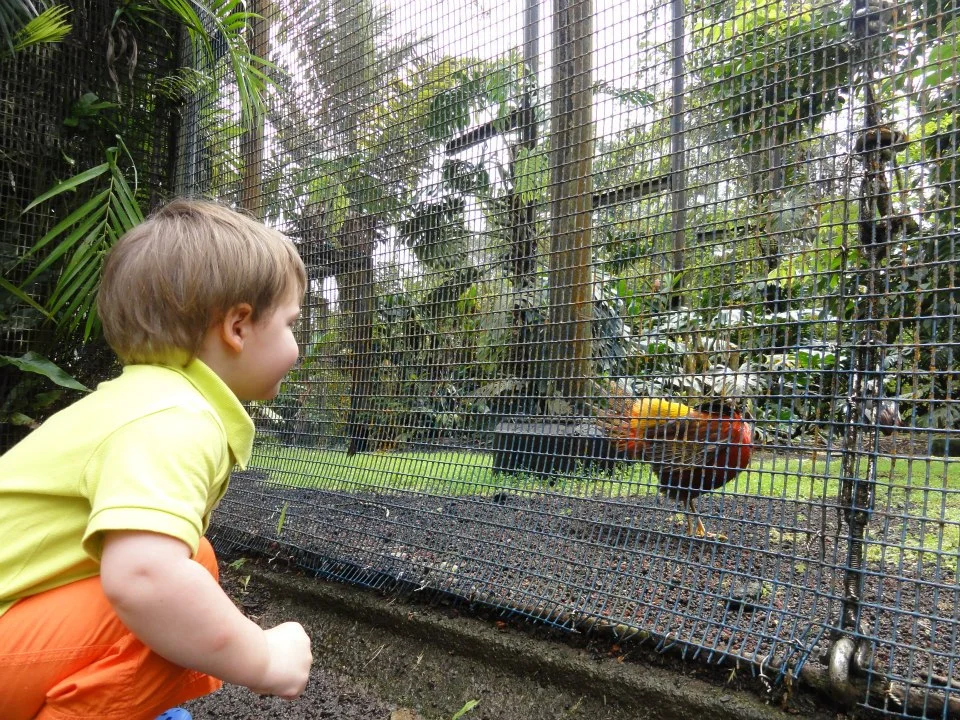
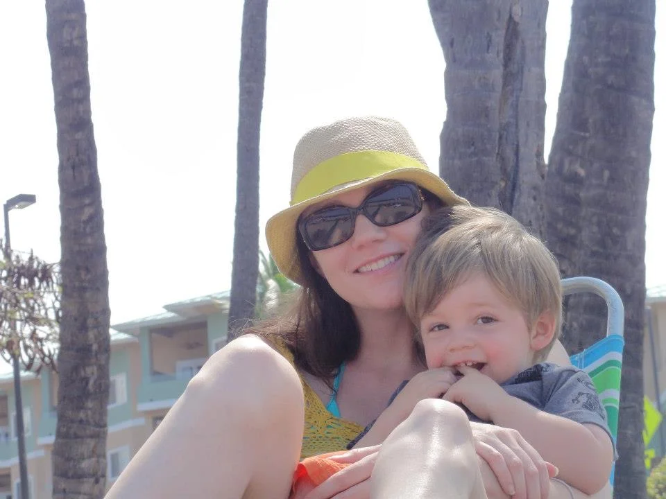

The next winter we were ready to escape the rainy Seattle weather again and head to a different Hawaiian Island. This time we decided on the Big Island. I really wanted to see a volcano. We decided to go for two weeks and this time we rented a one bedroom condo. It was so worth it to stay that length of time and the one bedroom made it nice because even though Wells went to bed early we could still watch movies at night.

The Big Island has a lot of attractions to keep your two weeks occupied. We stayed in Kona and rented a car which you definitely need to do. Here are a few suggestions for activities to keep busy. In Hilo they have a [farmers market](http://www.hilofarmersmarket.com/) on Wednesday or Saturday. We coordinated that with a driving tour of a bunch of waterfalls. I would suggest checking the weather before you leave as Hilo's weather is much different than Kona. It was sunny in Kona but downpouring in Hilo. The farmers market was great to visit though and had some great fruits and locally-made products. We also went to the [Hilo zoo](http://www.hilozoo.com/) which is free. There isn't a lot there but Wells enjoyed it and they have a great playground.

We had a great time visiting [Volcano National Park](http://www.nps.gov/havo/index.htm). I would suggest checking their website and doing more research before visiting now as the volcano is a lot more active than when we visited. We hiked one of the extinct volcanoes. I was quite proud of myself since I was 18 weeks pregnant with Isla. Hard to believe that was her in my tummy! We stayed till after sunset because the color is so beautiful against the dark sky. Luckily Wells was such an easy baby and he just fell asleep on the way home.

Another night we went to [Mauna Kea](http://www.ifa.hawaii.edu/info/vis/visiting-mauna-kea/visiting-the-summit.html) for an amazing sunset above the clouds and then stargazing after dark. It is quite the elevation shift so be prepared by drinking lots of water. As I was pregnant I got a bit nauseous on the car ride due to the elevation and the windy roads. Also, check the weather to make sure it is a clear night. It is quite cold up that high so dress as warmly as possible. It was beautiful to see the stars. My husband was particularly excited for this.

We went to two different macadamia nut farms/factories. The big one is [Mauna Loa](https://www.maunaloa.com/), south of Hilo, which was mostly a self-guided outdoor tour of the factory you could see through lots of windows. We had the most samples and variety of flavors at the [Hamakua Macadamia Nut Company](http://www.hawnnut.com/) in Waimea. Wells became addicted to mac nuts after these visits, and the ones we took home with us didn't last long! We also headed up into the jungle for a tour of the [Mountain Thunder Coffee Plantation](http://www.mountainthunder.com/). Although it was pouring rain the whole time we had fun looking at the coffee plants and taking in the smell of their small roasting room.

These are a few of the more major things we did on the island. The big island has some amazing beaches and views. We spent some days just exploring by car to stop at the black sand beaches or snorkeling. Wells loves to just play in the sand so as long as we have a bucket and shovel he is content wherever we go.

While we were in Hawaii is also when we announced our news that Wells would be a big brother! Hard to believe that was almost two years ago.

Our condo was on the beach so we were just steps from the sand. It wasn't swimmable but there was sand to play in which made Wells a happy camper. Also, it was interesting to explore the reefs and there was even a turtle visitor.

We had an amazing time on the Big Island and I would highly recommend it. Writing all of this is making me really excited to head to Kauai in a few short weeks. I will be much more pregnant this time around so it will be more about relaxing! Feel free to ask any questions and I hope you are all getting a little sun this winter!
