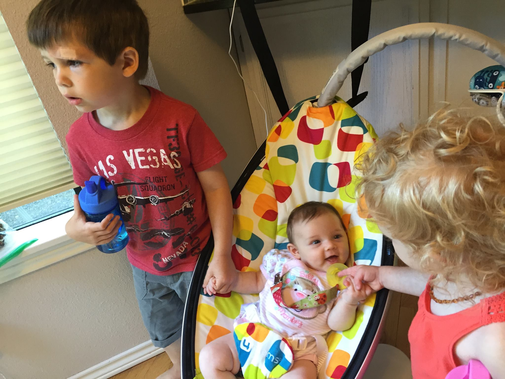

What an odd title to a post, huh? Well not if you are about to depart on a 6 week trip to London. Yes, the woman who said no more international travel with three young children is about to do just that! Isn't it funny how life works? We are going to London for my husband's job so in actuality this will be less vacation and more of a work trip, for both of us!

I will be traipsing around London with my wild bunch and instagramming and blogging throughout so if you start seeing a lot of pictures around London then do not be alarmed that I have been hacked, I will just be an international blogger documenting my adventure as I go.

This will be great practice for if we decide to move there, give us a feel for living internationally. I am under no illusions this will be easy. I fully expect this will be the most difficult time of my life. Adaira was just getting into a routine and sleeping more through the night, life with her was becoming easier (finally). My biggest worry is that the jet lag will completely throw her off.

It won't be all work, we are planning two weekend trips, one to Brussels and then to Paris for Isla's 2nd birthday. What a lucky girl to turn 2 in Paris, I am thinking she won't really care but will love eating everything out of the amazing bakeries found in every corner. After my husband concludes his work we will then be heading up to Scotland and over to Ireland for 2 weeks of vacation. We will then fly out of Dublin and be home in time for Wellington to start preschool.

Stay tuned for our grand adventure. The kids and I definitely plan to explore everything London has to offer. If you have been to London then feel free to provide suggestions, especially on beating the heat, since it is going to be in the 80's when we arrive!
