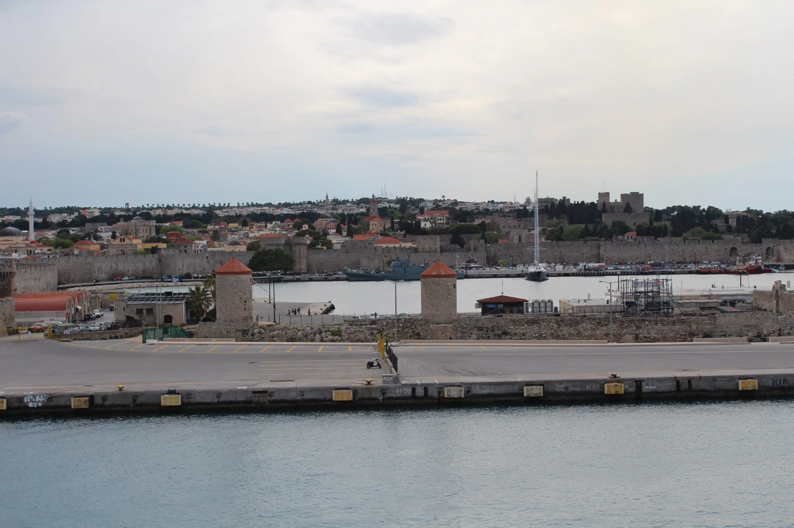

You have faithfully followed our adventure through Turkey. I hope you have enjoyed our journey because now we move to the last Turkish leg and onto our trip through Greece. From [Pamukkale](http://youngmodernmama.com/2014/10/traveling-abroad-pamukkale/ "Traveling Abroad: Pamukkale") we had to first take the shuttle to Denizli and from there a bigger passenger bus to the port city of Marmaris.

The journey by bus is a long one but it was beautiful to see more of the countryside and it was relatively empty which allowed us to spread out. The total journey time was around four hours. There is a bathroom on the bus and some drinks so it made the bus ride go by smoothly with our potty training boy.

There was a stop along the way for the military to check the passports of the Turkish men on board. We were a little confused when that happened and surprised they did not want to see our passports at all. Of course, there were very friendly people during the bus ride to help make the time go by fast. Once we arrived in Marmaris we walked from the bus stop to the port. It was around a mile journey and a little difficult with the kids and luggage but we made it and it was nice to stretch our legs after the long journey.

We were to catch a high speed catamaran to Rhodes, Greece. We went to pick up the tickets in the office, but they wait until the very last minute to open it up, which was a little nerve racking. Also, the boat was late so that set us behind. There were some added port fees to the tickets which weren't very clear. After we finally got our tickets (not an easy process) we were able to board the boat after going through some thorough security.

We had never been on a high speed catamaran before and I pray to never ride one again! The water was so choppy and the whole family except for Isla was sick. I couldn't believe it! Wells and Ian never get motion sickness so that is how bad the water and ride was. It was probably the longest hour of our lives. It felt like we bounced from high wave to high wave, like the worst stomach dropping part on a roller coaster over and over again. Think twice before you book that mode of transportation around Greece. It all depends on the conditions of the sea.

Luckily, we arrived intact and were happy to be back on solid ground! We had made it to the beautiful island of Rhodes and we knew that we were going to love Greece.

