Easter is a big deal in Greece. We were told that we would probably be invited to a local family's festivities. Coming from America this was a totally foreign concept to us, and we didn't believe it would happen, although my husband was holding out hope.

[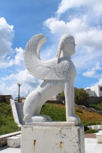](images/10357645_10100620112731114_5994488491410993604_o.jpg)

[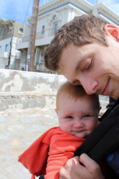](images/10295536_10100620111922734_3899609671944062412_o.jpg)

We arrived on Naxos and were picked up by the hotel. Most hotels on Naxos seem to offer this service as there were several vans waiting to pick-up people. We stayed in an apartment-like hotel room where the bedroom was separate from the living area which had a small kitchen. As we assumed most things would be closed for Easter we figured having a kitchen would be useful.

[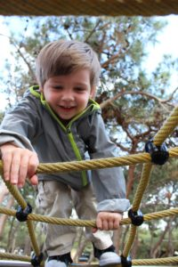](images/10321725_10100620111573434_22875198582007704_o.jpg)

[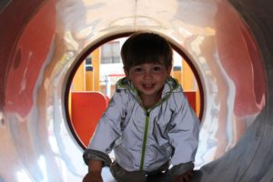](images/10272527_10100620118389774_5631944541598811162_o.jpg)

We walked to the grocery store to pick up food as there was a nice one within walking distance. It was larger and had quite a few options. Also, there is a local bodega more in town that has a decent selection. For food there are always gyro places around, and you really can't go wrong as long as the meat is fresh. We usually try to scope out what they look like before making our selection. On Naxos, as everywhere else in Greece, they had "Greek Frappés". They were incredibly popular (especially with the men). We actually liked them a lot and they were decently priced. Most importantly in the castle area there is a bakery that makes wood fired bread fresh every morning. It was a daily stop for us and you could usually get it while still hot. It is a little difficult to find in the winding streets the but so worth the trek.

[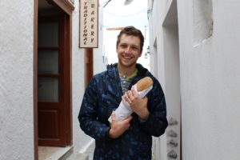](images/10317582_10100620118813924_7733142544155924154_o.jpg)

There is quite a bit to see on Naxos. We decided against renting a car but there is plenty to do on the island if you choose to and more historical sites to see. We found lots to do within walking distance of our hotel, which was just south of the downtown area. We visited the Portara, a beautiful arch facing towards Delos which is Apollo's birthplace. You could go right up to it to see and take pictures. It really makes an awesome site on a sunny day and you can see most of the island. After that we hiked up the mountain to a chapel located there. It looked down all over the town and was breathtaking. It was a pleasant hike but with a baby on your back and toddler to carry can be difficult. Luckily, there was a very nice lady who drove us up to the monastary. Also, she spoke Greek which was so helpful for getting us in. I don't think we could have made it without that ride. The monastary was a nice place to visit on Easter and the nun was very accomodating.

[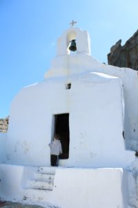](images/10256438_10100620110340904_8485235965200766489_o.jpg)

[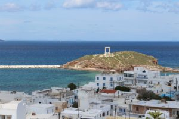](images/10355414_10100620119342864_7784672523097716435_o.jpg)

[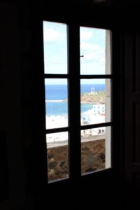](images/10431429_10100620112411754_2988300682243149380_o.jpg)

[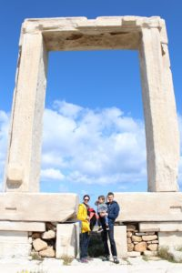](images/10397158_10100620109986614_4926008802561688554_o.jpg)

[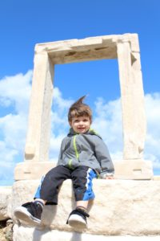](images/10397237_10100620111014554_1914890417168710993_o.jpg)

[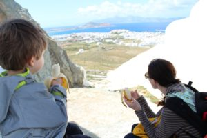](images/10296468_10100620114757054_706616388430398406_o.jpg)

[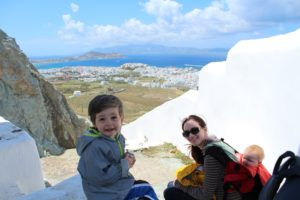](images/10382511_10100620114632304_6432021367836251735_o.jpg)

After that as we were walking home and close to our place we stumbled upon a family having Easter dinner. They offered us some amazing food and warm hospitality. They really are kind in Greece, and particularly on the laid back, less touristy islands like Naxos. It was a perfect way to spend Easter, getting a glimpse into this warm culture. My husband and I often wish we had come from such a tight-knit culture.

On another day we visited the town to explore. There was a Venetian castle we visited. The town has so many nooks and crannies to visit. For us it became a daily visit after the first time so we could find the amazing bread. We stayed right by the water and we walked along the beach and spent time playing in the water and sand. It was an idyllic time to rest and recuperate from our journey.

[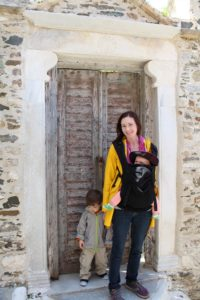](images/1957935_10100620112386804_9149107284912259958_o.jpg)

[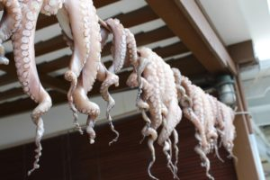](images/10359131_10100620118519514_2642676217762443903_o.jpg)

[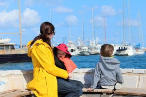](images/10333500_10100620116024514_5812403896691062520_o.jpg)

[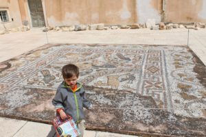](images/10271426_10100620119332884_5687406397128964844_o.jpg)

I hope you enjoy our pictures of Naxos as much as we did. Feel free to ask any questions you may have. From there we headed on a high speed ferry to Athens. It was very packed and uncomfortable, difficult to find seats. I would really suggest taking Blue Star everywhere.

[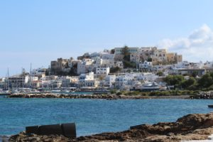](images/10386931_10100620116842874_2987842307444645415_o.jpg)
