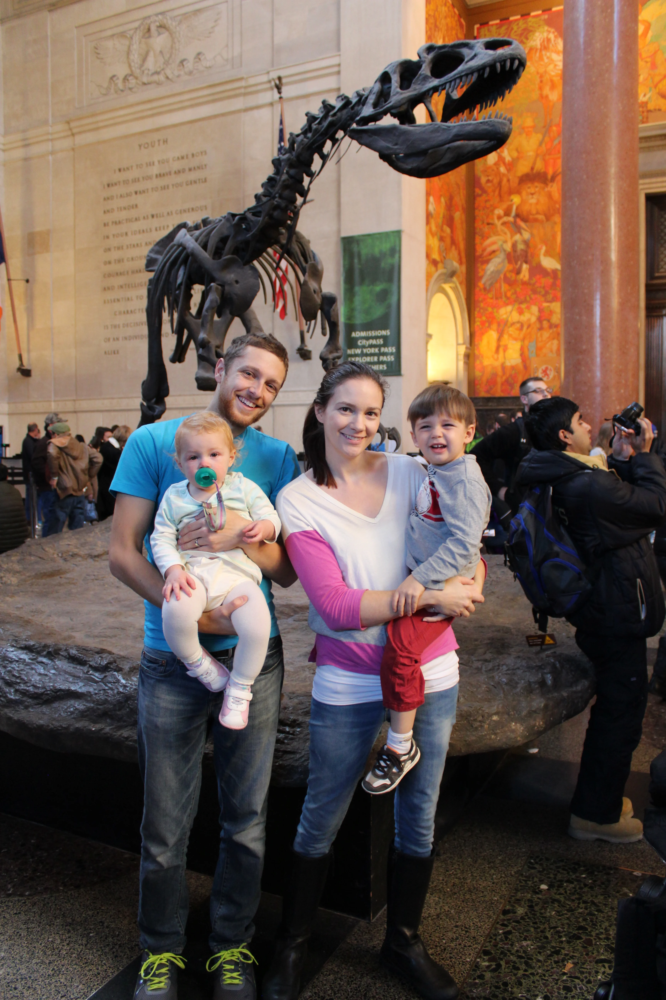

Now for the happier parts of our trip, everything we did in New York City. Now the kids and I had two days by ourselves that my husband was in meetings. We were staying in the East Village so the first day I stayed around the Union Square area, close to our apartment because I was exhausted from the [long travel the day before](http://youngmodernmama.com/2014/11/traveling-stateside-new-york-city/ 'Traveling Stateside: New York City'). The kids did not sleep in as late as I thought they would so it was good for us to be close for nap time. We walked through Union Square and explored all the shops nearby. Wells loves the playground in Union Square and Isla loved all the people watching.

The next day we had a relaxing morning, met my husband at his work for lunch, and then set off for the library, Bryant Park, and MOMA. The library was absolutely beautiful. Isla loved how her voice echoed off all the marble. As you can guess we were great at blending in! Bryant Park was one of my favorites. The Christmas shops and ice skating rink were set up. Wells loved the ice skaters and of course anything Christmas. After that we walked down fifth avenue and met my husband at the MOMA. This is a must see in my opinion with some of my favorite artists, Monet and Van Gogh. My husband was very excited to see Starry Night. There was also a special Matisse exhibit. We didn't have to stand in line for that because of our stroller. A nice little benefit and one of the only I experienced in New York. We walked around after to see the Empire State building.

On Saturday we went to the American Museum of Natural History. The museum is huge, and very exhausting if you try to do it all in one day. My husband loves museums so moving through quickly is usually not an option. Wells loved all of the dinosaur skeletons. The outer space exhibit it also phenomenal. I think if I lived in New York I would definitely have a pass and take the children weekly. After that we headed to Central Park. Strolling through here in summer must be paradise but in 40 degree weather it was a bit frigid. We saw the reservoir, castle, and turtle pond. After that we headed to the Guggenheim. The rounded structure makes it easy to use for a stroller. It is worth going for the beauty of the building and on Saturdays you can't be the price, "pay what you want" (most people paid $1 per person). After this we headed to Rockefeller center to watch more ice skaters.

On Sunday we headed to the 9/11 Memorial and Museum. This is definitely a must see. The pools are beautiful and serene, a perfect memorial for this tragedy. Afterwards, we went to the museum. It is a beautiful brand new structure. The museum is very large, but the main exhibit is in a center, smaller area. I definitely cried a lot during this museum. If your kids are of an age to ask questions this will be a very somber and thought-provoking museum for them. Following, we headed to FAO Schwartz for some kid time. It is a massive store and very busy. We visited the piano and there were more toys than you can imagine. A perfect place for a little boy to make his Christmas list. Then I took my husband to Bryant Park. It was just as beautiful at night.

This ended our grand New York adventure. We wanted to get to the MET the next morning but it was pouring rain! It was too difficult to do before our plane ride. However, our plane was over an hour late so maybe we could have made it. We enjoyed some beautiful sights, good food (I love Shake Shack), and interesting characters. There were difficult parts to our trip as there will always be when traveling with children but we enjoyed our time.

If you have any questions on sights to see or visiting New York with children feel free to ask! Happy Thanksgiving!
