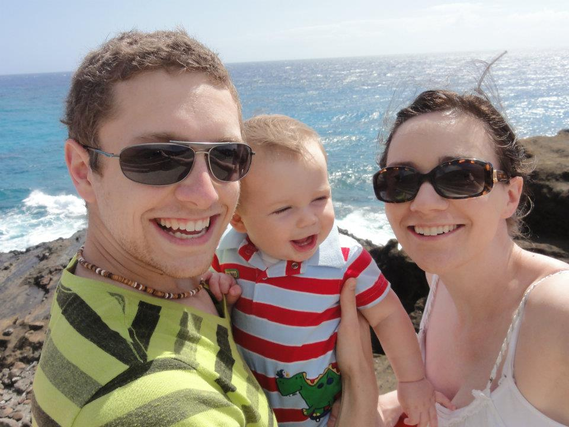
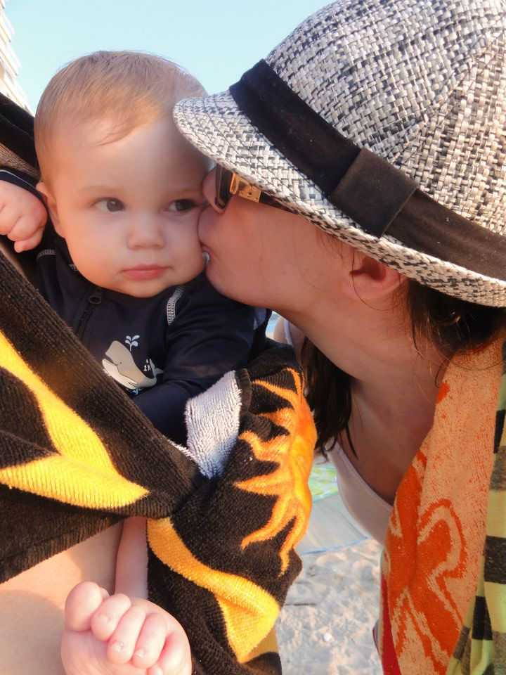
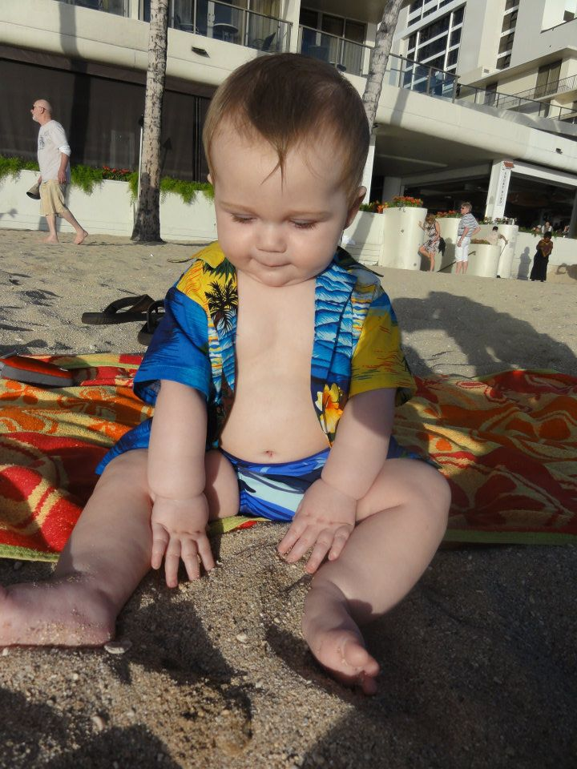
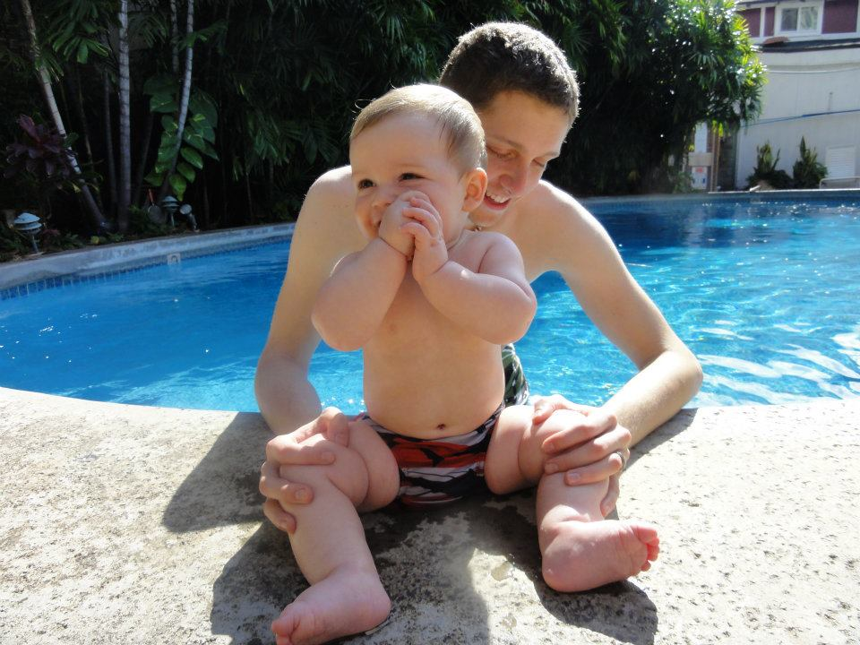
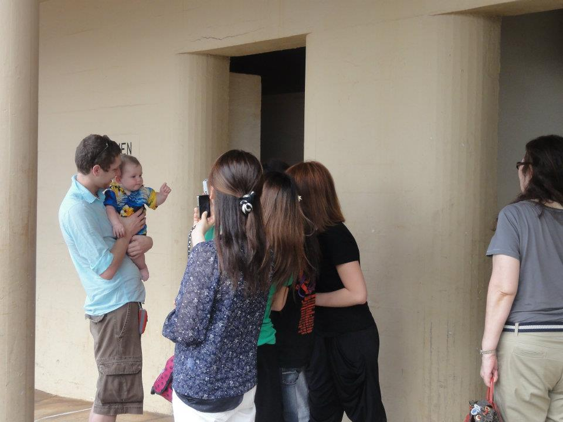

As I look back on the pictures to write this post it seems so surreal. Once upon a time we were a family of three and my 3 year old was only 7 months when we took this trip. People always tell you how your kids will grow up so fast but you never understand it until it happens to you or for me when you look back at pictures and are amazed at how big your kids have become.

This was our first trip to Hawaii. Wells was a perfect age to travel with and one I really recommend at 7 months. He wasn't crawling yet so it was easy to contain him. We took a red eye so he was great in the carrier. Also, he was a very smiley baby so he made lots of friends wherever he went. From Seattle, Hawaii is about a five hour flight. It was a perfect relaxing trip for us to take.

We stayed in Waikiki a couple blocks from the beach and our place had a kitchenette. We were able to cook a lot of our meals in our place which helped eliminate a lot of the cost. Also, we rented a car which I find essential when you go to Hawaii. We were able to drive to the grocery store. We did eat out a few meals particularly on the North Shore. We loved the atmosphere over there and this [Hawaiian shave ice store](http://matsumotoshaveice.com/) in the little town became a favorite. My husband also fell in love with the [Honolulu Cookie Company](http://www.honolulucookie.com/).

We did quite a few activities on Oahu. The most strenuous was probably climbing Diamond Head. We used our Ergo carrier for the hike and I had to nurse Wellington at the top. It definitely made for a memorable climb. It took about an hour. I would suggest bringing lots of water and the earlier in the day the better because parking can get difficult.

As I mentioned earlier we loved the North Shore. We spent a lot of time over there watching the surfers and taking drives. Towards that area we toured the Dole Plantation. We really came to love dried pineapple.

The swap meet at the stadium was a fun couple of hours. It is the perfect place to get souvenirs for much cheaper than you can find in the shops. We bought Wells a Hawaiian outfit which he wore to a luau, which was about an hour drive. Traffic in Honolulu is very bad, usually in the top 5 in the nation. I would avoid driving anywhere during rush hour. You will have a much more relaxing vacation if you avoid that at all costs.

Also, hanging out in Waikiki was a lot of fun. There are a lot of shops. Driving around the island was another highlight. There are so many viewpoints to stop and see. This made a perfect nap experience for Wells. We spent a lot of time on the beach. Wells loved playing in the sand and experiencing swimming for the first time. He looked great in his swimsuit.

Another must visit is Pearl Harbor. The tour is free and a very moving and touching experience. I wouldn't miss this in Hawaii. It was about a half day. Wells did great on the boats and through the exhibit.

If you live on the west coast Hawaii is a perfect winter destination with lots of deals on airfare. I would suggest using Airbnb or other condo sites to find a place. This is much more cost effective than a hotel.

If you have any questions feel free to ask or message!
