After traveling extensively through Turkey and that [arduous ferry ride](http://youngmodernmama.com/2014/10/traveling-abroad-marmaris/ "Traveling Abroad: Marmaris") we found ourselves in the beautiful ancient city of Rhodes! It felt like we were starting vacation all over again to explore a new country. Instead of a hotel this time we stayed in an [Airbnb rental](https://www.airbnb.com/rooms/1037492). The man met us at the ferry and drove us to the rental. He was very nice and the rental was truly amazing. It was a great value and we each had our own rooms and full kitchen! Plus, it was inside the old city walls, which gives you the feeling of stepping back in time. This was seriously the best decision we could have made. The kids slept so amazingly well. Also, the hosts left fruit, wine, and chocolate. It is always the small touches that really make a difference.

For food, well that was easy because we were so excited to try gyros and were they ever worth the wait! I could eat one everyday and be very happy. Luckily, they are everywhere and on Rhodes they were 2.50 euro. They come packed with chicken or lamb, tomatoes, onions, lettuce, tzatziki sauce, and, of all things, french fries. They are always freshly made and the kids loved them, too. We also stopped at a supermarket (they are only in the new town) to buy some delicious olives. For breakfast we had fresh fruit and bought some eggs at the supermarket as well.

[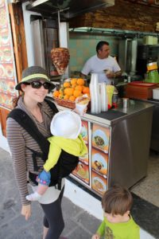](images/10353453_10100614725087994_1439501240964074513_o.jpg)

We stayed in Old Town because of the central location. Most of the museums were accessible by foot. We did do a day trip to Lindos on the other side of the island, a comfortable bus ride away. We used our stroller throughout the city, despite the sometimes odd paving of round flat stones stuck upright. The sidewalks are narrow in old town and the cobbled streets are a little bumpy. You were not able to use a stroller in the museums so be aware of that and bring a carrier or plan accordingly.

I think you need to brace yourselves for Greek museums. They are not as approachable or as friendly as in Turkey but the biggest disturbance in my experience is the staff. Every room in every museum had someone working and standing guard even if all the artifacts are behind glass cases. They will follow you around to other rooms most ardently. It was so off-putting to feel constantly watched. I think it would have been less annoying if they had offered knowledgeable and useful facts about the displays we were looking at or at least a friendly remark. However, that was not to be. Also, we were visiting in the off season so sometimes we were the only ones in the museums, in which case we were considerably outnumbered by staff. It was one of the strangest experiences we have encountered.

We visited the Archaeological Museum and the Palace of the Knights on the first day. I believe that you need to only see one of them and I would definitely chose the palace. While the building and grounds of the first are gorgeous the second museum surpassed it. There are beautiful mosaics in both, mainly pillaged from the island of Kos. The children were very good throughout the museums.

[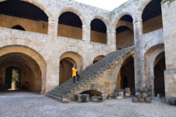](images/10369000_10100614721480224_4920485099134529661_o.jpg)

[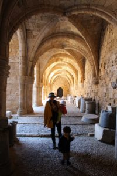](images/10333378_10100614721774634_7540254230675810954_o.jpg)

[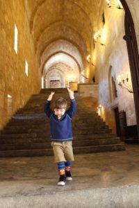](images/10259179_10100614722079024_4711141876991896684_o.jpg)

[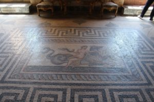](images/10383845_10100614722188804_1232399792353595404_o.jpg)

[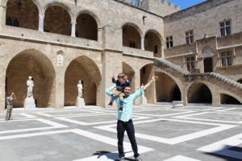](images/10257950_10100614722558064_4307973901106365083_o.jpg)

[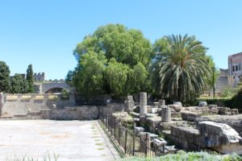](images/10358947_10100614722757664_6427444782475817006_o.jpg)

Exploring Rhodes is another wonderful part of the experience. We loved wandering around the winding streets and experiencing the beauty and history of the old city. There are a few ruins to explore, including a nice walk along the former city moat (not stroller friendly), and many great views of the Mediterranean. Above all, Rhodes was probably the most peaceful part of the trip.

[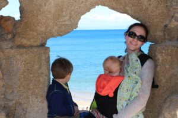](images/10333471_10100614723371434_3107565882942718353_o.jpg)

[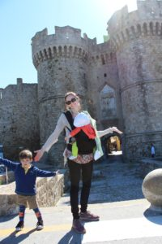](images/10258925_10100614723775624_3829972633943088913_o.jpg)

The day trip to Lindos is a definite must-see for the ruins high up on a hill. We did not bring our stroller because of the many stairs throughout the city and the hike to the top. It was definitely a journey to the top but worth it. However, if you do not feel up for a long steep hike then you can hire a donkey to get to the entrance of the site. I do not think it is worth it just to get through the city but that is always an option and maybe a novel experience. Not only were the sites interesting but you could see the cities surrounding it. It was breathtaking and you understood why they would build a city on top of such a site. On the way back we rewarded ourself with a gyro and ate it with a view.

[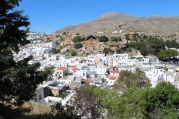](images/10258734_10100614724060054_1459337853526345462_o.jpg)

[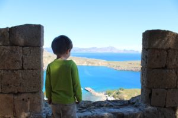](images/10293846_10100614724094984_7599976652826820657_o.jpg)

[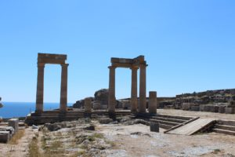](images/10258305_10100614724643884_3216656151010207656_o.jpg)

Back in Rhodes, we had some extra time to explore a little outside the city to see the amphitheater and ruins of a temple. They were interesting to see if you have extra time but not a must-see.

[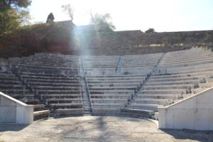](images/1909186_10100614725217734_3734965499895797029_o.jpg)

[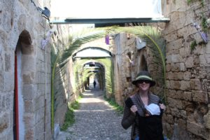](images/10259247_10100614725522124_7106538061403685956_o.jpg)

[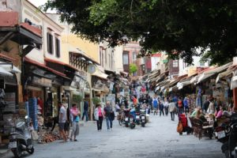](images/10258227_10100614725851464_7042356783041808091_o.jpg)

[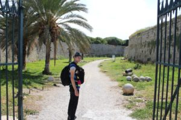](images/10368972_10100614725976214_8434064343885441913_o.jpg)

We loved our time in Rhodes. It is a beautiful city full of history and culture. We probably stayed a little longer than required, but it was nice to rest and soak it all in.
