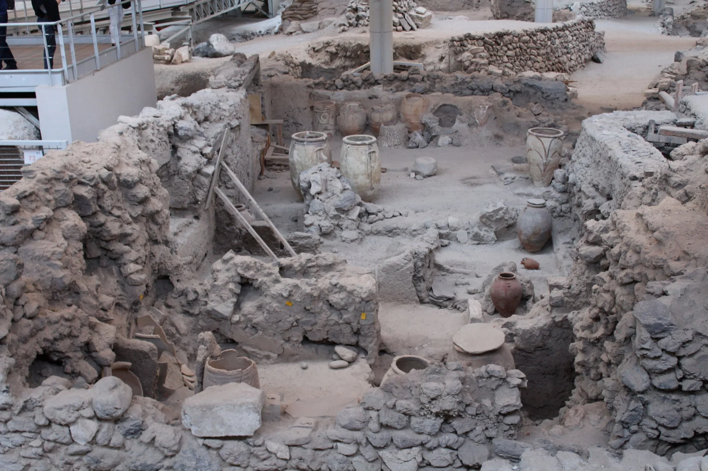
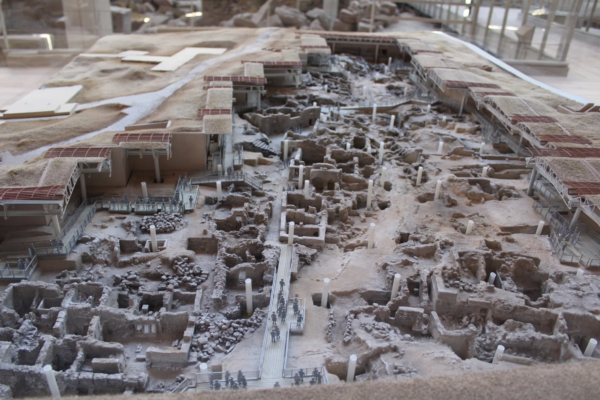
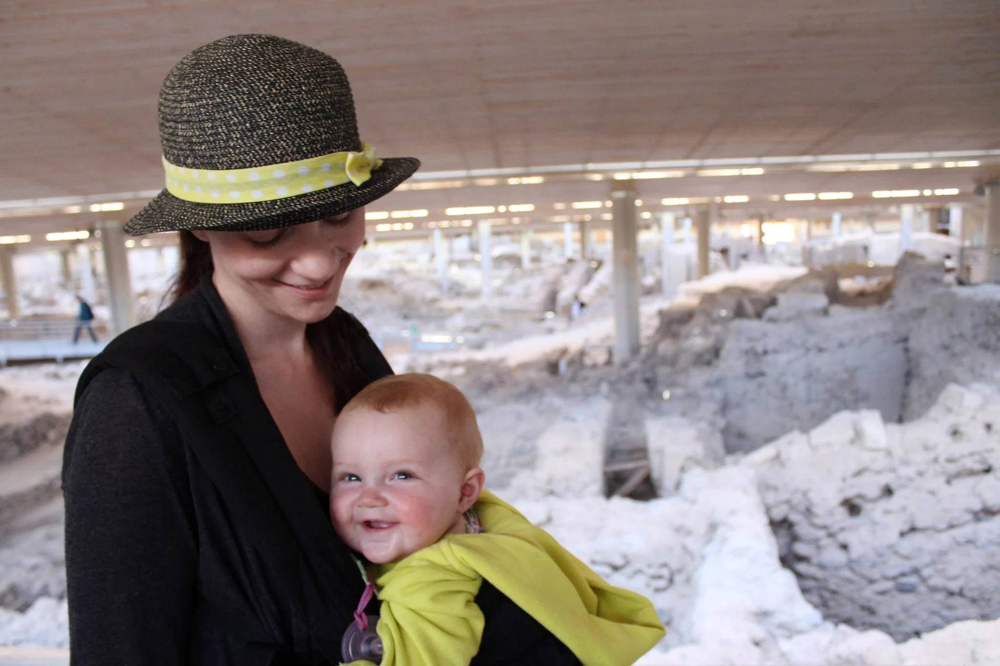
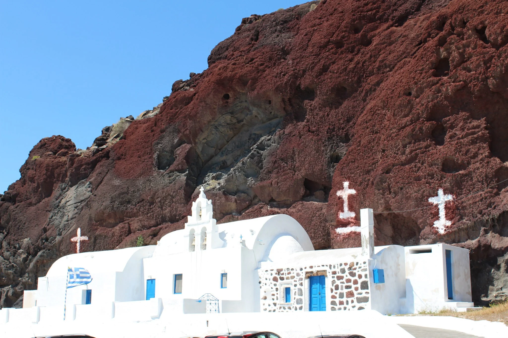
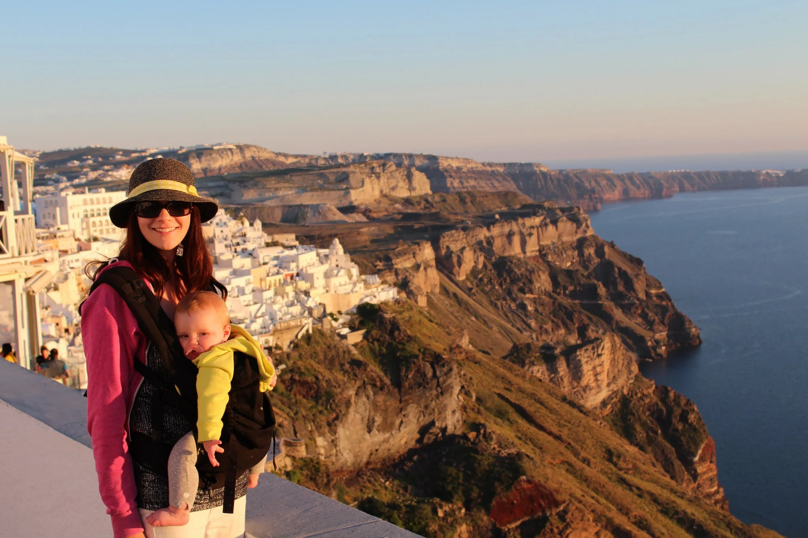
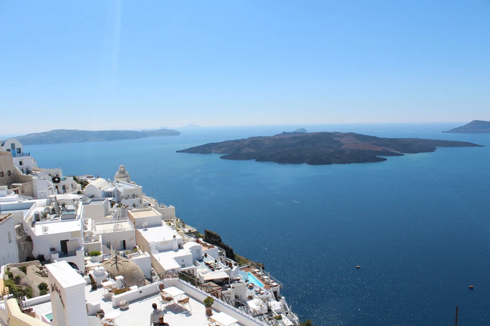
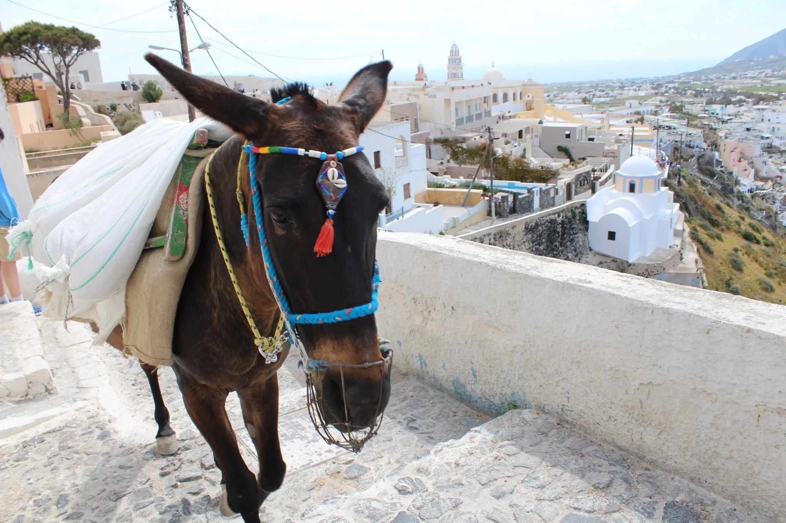
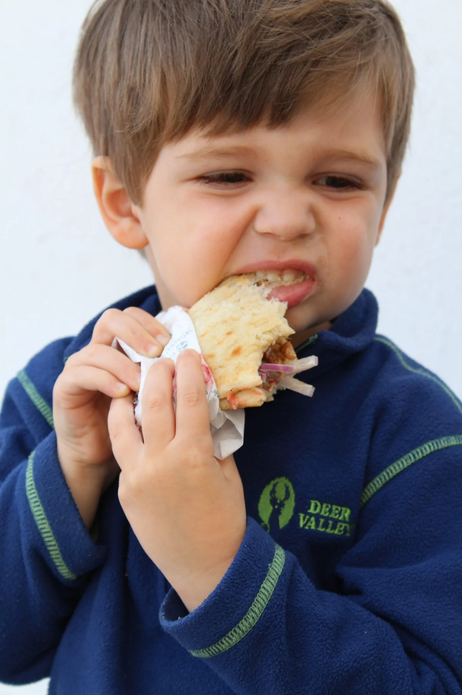
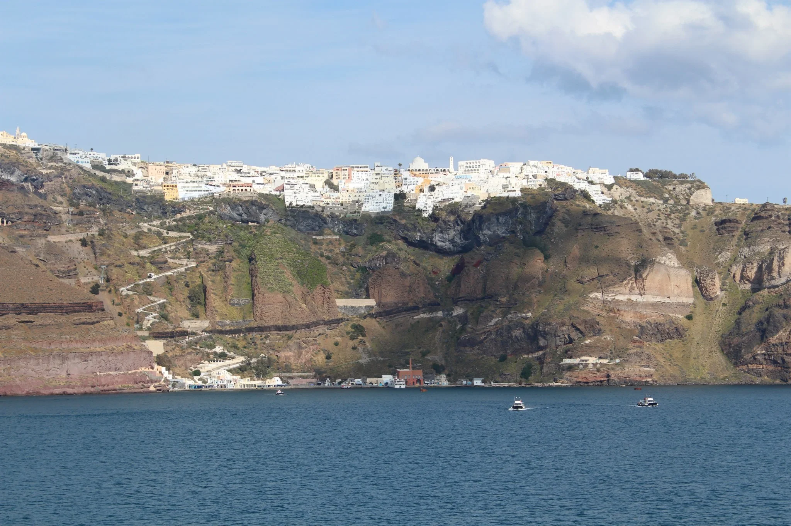

After we left [Rhodes](http://youngmodernmama.com/2014/11/traveling-abroad-rhodes/ "Traveling Abroad: Rhodes") it was on to the next Greek island, Santorini. Instead of a high speed ferry we took the Blue Star Ferry. I highly recommend this line and it is the only way I would travel in the future between islands. It is like a cruise ship and very roomy. We reserved seats, though I don't think it is worth the extra cost since you can generally find seating throughout. Granted we did go in April, so it might be different during the busy summer.

It was a long ferry ride and we arrived late at night. Our hotel, [Villa Fotini](http://santorinivilla.com/), picked us up at 2am and dropped us off out front. It was a long, windy road and a bit frightening at night! I would never want to drive that. After getting to the hotel we were exhausted and found out our room was not ready that night so we would have to move rooms in the morning. An inconvenience but doable since we didn't start unpacking.

The hotel served breakfast, and the owner, Maria is so friendly. She made us a delicious breakfast with some pastries, eggs, and coffee. Also, she made hot chocolate for Wellington which he loved! She was very helpful with information and dropped us off in town so we could catch a bus to Akrotiri. An hour later we were dropped off right in front of the site.

Akrotiri was an ancient civilization buried by a volcano and preserved until recent excavations. All of the inhabitants had already left so it appears they knew it was coming. It was a wealthy civilization. The site is completely covered for preservation. The guides at this site are knowledgeable and willing to answer questions you may have. We did not take our stroller because there were a lot of stairs going around the site. After we finished we walked down to the water where a beautiful church was. The water is truly beautiful in Greece.

After the bus ride back we got dinner in town and walked along the caldera. Of course we had more gyros which were equally as good. The prices on Santorini are a bit more expensive than other islands. It is more of a well known tourist destination due to cruise ships and a wealthy resort town. We were able to catch the sun set over the caldera. It is really beautiful along the cliffs.

The next morning we had another excellent breakfast and explored the town as we did not have time the day before. There is not a lot to do on Santorini and it is more about relaxation as evident by the many cliffside resorts. You kind of just wander around the town and go up and down the different alleys. This is definitely not a stroller town as there are stairs and tight alleys to get to some of the shops. Santorini has bakeries and we bought some cookies for dessert. Also, we had more gyros. There are plenty of options, so it is best to see where the locals eat and where people are lining up.

There is a funicular that goes to the port where the cruise ships dock. I believe it is also walkable but we did not do that. We were content with enjoying the view and soaking in the culture. After another great sunset it was time to call it a night. The next day after breakfast we were dropped off at the port to catch a ferry for our next island adventure!

