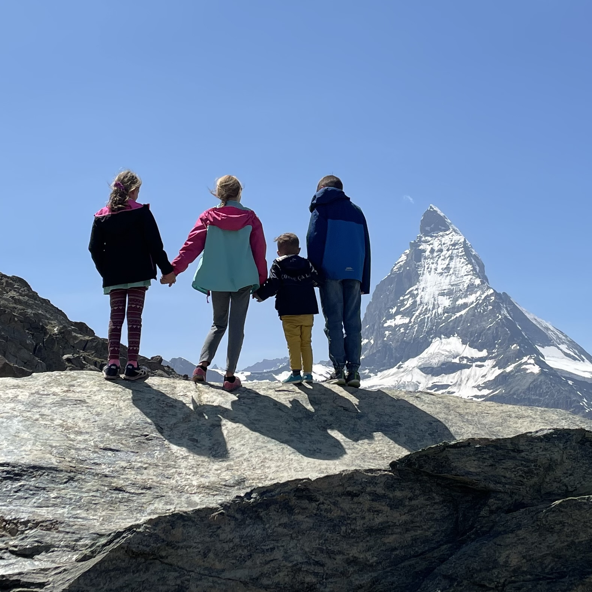

This is just a rough brain dump of the places we've been in Switzerland.

## Luzern

### City

- Wall and towers https://www.tripadvisor.com/Travel-g188064-c177563/Lucerne:Switzerland:Lucerne.City.Walks.html 
- Swim: free at Inseli behind the wharf 
- Lion statue and Glacier Garden (Gletschergarten) 
- Old town and bridges 
- Coop and migros in Bahnhof 
- Street food on Grendelstrassa 
- Swiss Museum of Transport

### Mountains

- Pilatus - Golden round tripLucerne -> boat to Alpnachstad-> cogwheel train to Pilatus -> gondola to Krien -> bus No. 1 2to Lucerne
- Mt Rigi
  - 1. Boat ride from Lucerne to Vitzau  
  - 2. Vitzau to Rigi Kulm by cog wheel train.  
  - 3. Lunch at the peak, short hikes 
  - 4. Rigi Kulm to Rigi Kaltbad to Weggis 
  - 5. Weggis to Lucerne by boat 

## Wengen

Hotel Victoria-Lauberhorn

Wengen - Schilthorn, Trummelbach falls 
http://www.momstotszurich.com/2015/04/allmendhubel-flower-park-playground.html/ 
http://www.momstotszurich.com/2015/04/murren-childrens-adventure-trail.html/ - from Murren 

- Train Wengen to Lauterbrunnen 
- Cable car Lauterbrunnen to Grütschalp 
- Narrow gauge train Grütschalp to Mürren 
- Cable car Mürren to Schilthorn 
- Cable car Schilthorn to Mürren 
- Cable car Mürren to Stechelberg (change in Grimmelwald) 
- Bus Stechelberg to Trummelbach Falls (Lauterbrunnen) 
- Bus Trummelbsch Falls to Lauterbrunnen 
- Train Lauterbrunnen to Wengen 

Opposite: 

 

- Start at Wengen 
- Train to Lauterbrunnen 
- Bus to Stechelberg (stop at Trummelbach Falls) 
- Cable car to Murren (change in Grimmelwald) 
- Cable car to  Schilthorn (change in Birg) 
- See Schlicthorn! 
- Cable car to Murren 
- Narrow gauge train to Grutschalp 
- Cable car to Lauterbrunnen 
- Train back to Wengen 

## Geneva

Stayed in Annemasse, much cheaper, super easy to take the tram in

Lausanne
https://www.touringswitzerland.com/how-to-spend-1-day-in-lausanne-switzerland/

## Moléson-Gruyères

We stated at the ski resort, but they have a all access pass for a bunch of activities and the gondola

- Day trip to Gruyères
  - Bulle for Lidl
  - Walk the town
  - Walk around Gruyères Castle
  - Ramparts
  - ⭐️La Maison du Gruyère, museum, factory, cheese tasting €12/12 CHF for family
  - https://arzotravels.com/best-things-to-do-in-gruyeres/
- Bob-Luge Moléson alpine coaster

## Zermatt

- Cogwheel train to Gornergrat, sit on right side of train, all tickets are 1-way priced, so don’t buy round trip
  - 07:00 08:00 08:24 08:48 09:12 09:36 10:00
  - See the black nosed sheep, ask
- Hike the scenic loop 0.4 mi
- For panoramic views of the area, continue up the trail behind the hotel. From here, you can see the Gorner Glacier, the second largest glacier in the Alps. You can also see the Monte Rossa Massif and Switzerland’s highest peak, Dufourspitze.
- Hike to Riffelsee for great views:
  - You begin your hike at the Gornergrat mountain station.  First of all, make the most of the viewing platform to look at and enjoy the many peaks you can see from there.  By using the free telescopes you can discover the names and heights of the various summits.  Then you make your way along the Hohtälli ridge where the steep descent towards the Gorner Glacier will take some concentration. 
  - Then you come to the Monte Rosa hut approach; you don’t go towards the hut but take the way with the view of the Matterhorn ahead of you. A new and very special perspective of the Matterhorn is waiting for you!  Now the path is gentle, going up and down, towards the Riffelsee lake.  We recommend a stop there to take some photos or have a picnic.  Finally, you have a choice of routes that will take you down to the Riffelberg  station. 
- Swiss Topwalk trail (#23) to Riffelberg, or short walk to Rotenboden and take the train back to Zermatt
  - There is a small lake after Rifelsee with a large rock on the other side for a great picture
- From Riffelberg, take the Gornergrat Railway back to Zermatt (CHF 40) or ride the Riffelberg Express to Zermatt (CHF 39.50). The Riffelberg Express is a cable car that runs from Riffelberg to Furi. Once in Furi, change cable cars to continue to Zermatt (included in the CHF 39.50).

### Day 2

- Sunnegga - funicular to Sunnegga, gondola to Blauherd, cable car to Unterrothorn.
- Back down to Blauherd, Marmot trail to Sunnegga to up 13 CHF,
- Walk to Leisee, cross the lake by the rope boat, playground
  - Sunnegga Blauherd Rothorn Funicular on Google Maps
  - Hike only to Stellisee on the 5 lakes trail, 2mi round trip
  - After going up to Blauherd, Ride a mountain cart to Sunnegga. Rent a mountain cart at the Blauherd station and ride it on a gravel path to Sunnegga.

### Day 3

- Matterhorn Glacier Paradise via Furi & Schwarzsee, then ride the cable car to Trockener Steg, hike 4.5 miles on the Matterhorn Glacier Trail to Schwarzsee, and ride the gondola to Zermatt
  - From the Info Cube, walk downhill in the direction of the gray lake and the Matterhorn
  - https://www.earthtrekkers.com/how-to-visit-matterhorn-glacier-paradise/
  - 415 last down
  - Trail closed too snowy, hiking down from Schwarzsee instead

## Bern

One day to see the city, the bears. Lots of shopping in old town.
