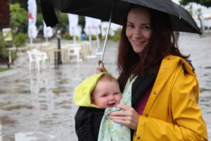
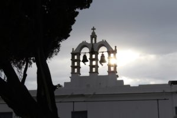
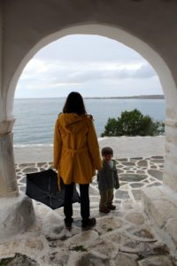
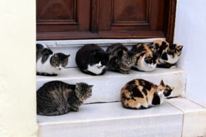

After leaving Santorini we took a ferry to the less-traveled island of Paros. There were fewer archaeological sites to see and we spent most of our time just experiencing the Greek way of life. We rode in on a Blue Star Ferry, which confirmed for us there is no better way to travel. It was pouring when we arrived and did so most of the next day. We were leaving the day after so we had no choice but to venture out and see the sites. Thankfully [Hotel Oasis](http://www.tripadvisor.com/Hotel_Review-g642171-d6694928-Reviews-Hotel_Oasis-Parikia_Paros_Cyclades.html) was literally steps from the port in Parikia, and we got inside during a little break in the rain before it began to pour again. The room was a little buggy, but we enjoyed the ocean view and spacious corner suite.

The town reminds me of the Greek island towns you picture that are white washed with painted stone streets. There was a beautiful church, the Panagia Ekatontapiliani, to stop at that had some ruins to explore. It was definitely worth seeing if you are on the island. We were some of the only people out that day due to the rain so it was relaxing time to see the city. Also, Wells really enjoyed jumping in puddles.

There was a grocery store nearby that makes for a very picturesque walk as it follows the water. They have all the things of a typical store, though quite condensed and very busy. Also nearby were gyro stands and very good ones right by our hotel and the water. There were two right by each other so we would switch between them. We could not decide our favorite. There are bakeries on the island, too, with cheap freshly baked bread.

To see more of the island you can definitely rent a car but we chose to stay in town so we wouldn't have the hassle of driving in a foreign country. It was a relaxing visit and on our last day there it was sunny and beautiful. We were able to walk and enjoy the beauty of the island without umbrellas once again. Luckily we had time before our ferry left in the early afternoon. Museums were free that day in Greece and we stopped in a little archealogical museum. It was a tiny museum but with some nice Greek relics. Uncharacteristically for Greece, and perhaps due to the holiday, we had a lot of freedom to explore without being hounded by museum staff.

After that it was time to go, but our ferry was late. Apparently that was a common situation and especially for the ferry we were taking. It was not as nice as the Blue Star ferry and very empty. I would not recommend taking this one but the timing was good for us, minus the delay.
